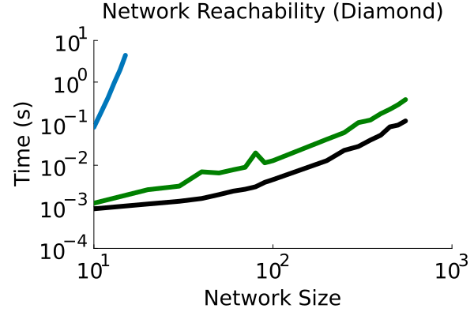
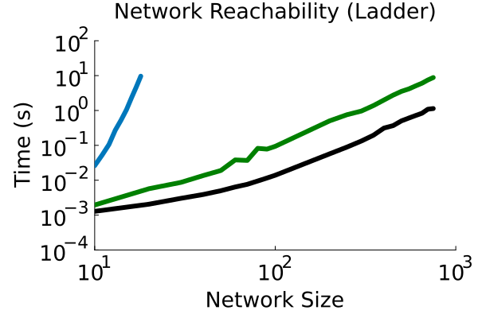
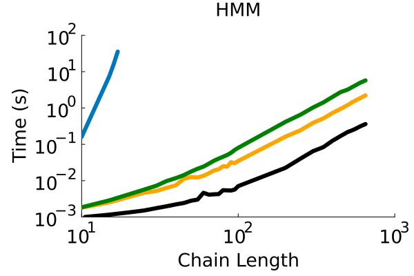
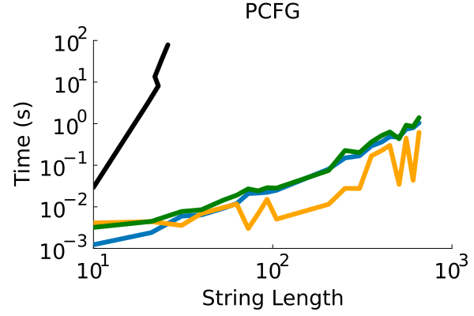
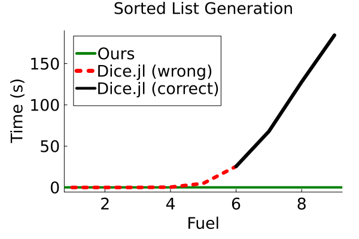
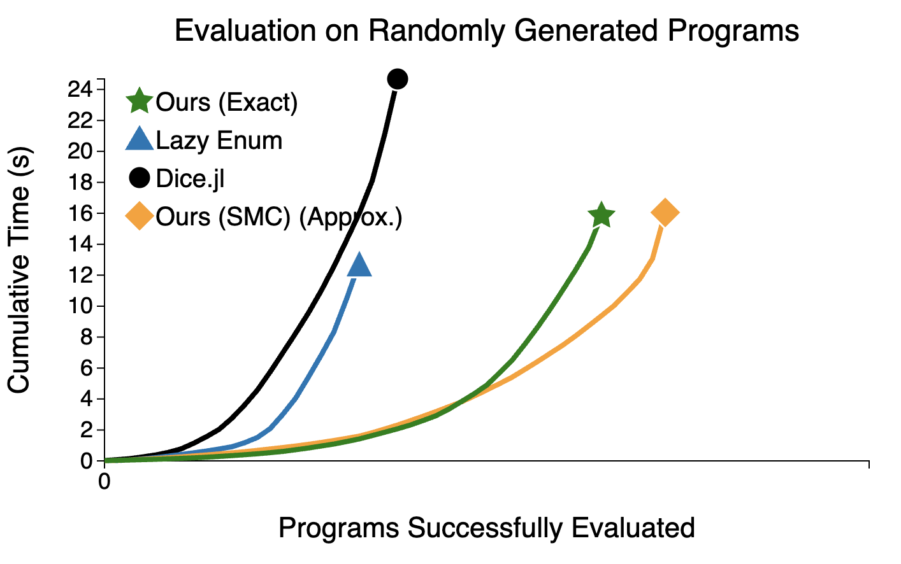
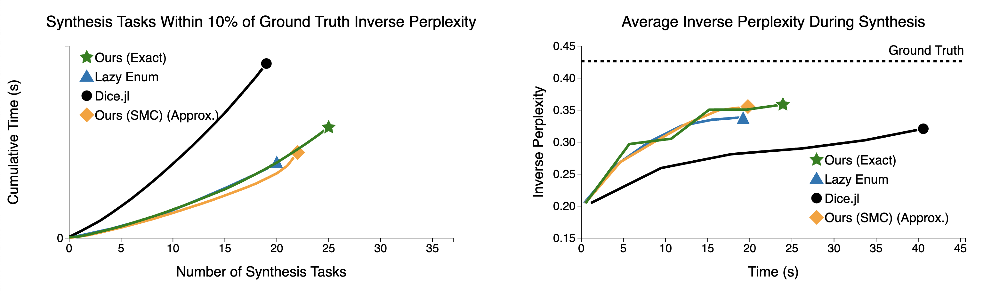
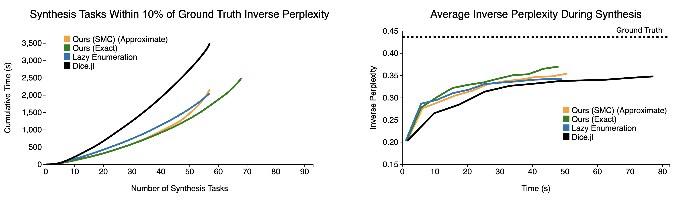

Thank you for taking the time to evaluate this artifact. This artifact is for reproducing the results of the paper "Stochastic Lazy Knowledge Compilation for Inference in Discrete Probabilistic Programs" (PLDI 2025 Submission #545).

# Kicking the tires (Getting Started Guide)

## Getting the artifact

### From GitHub

```
git clone --recursive https://github.com/mlb2251/pluck-artifact.git
```

### From Zenodo

Download and unzip `pluck-artifact.zip` to make a new folder `pluck-artifact`. We recommend updating to get any recent tweaks/improvements in the repo (including to `README.md`):

```
cd pluck-artifact
git pull
git submodule update --init --recursive
```

## Docker setup

The artifact is set up to run in Docker - you can pull the docker container like so:

```
docker pull mlbowers/pluck-artifact:latest
```

From the root of the repo, launch the docker container with:
```
docker run -it -m 60g -p 8000:8000 -v $(pwd):/pluck-artifact mlbowers/pluck-artifact:latest
```
On some systems, including a default Linux installation, special permissions are required to launch a docker container, in which case this command must be run with `sudo`. Alternatively,  you can [configure non-sudo access to Docker](https://docs.docker.com/engine/install/linux-postinstall/).

The `docker run` command above will launch the docker container with:
- an interactive terminal (`-it`)
- A 60GB memory limit (`-m 60g`). This is unnecessarily large, though we did notice some baselines we compare to within the docker container can reach up to 40GB (despite taking less on our machine outside of the container). However these high-memory baselines can be avoided as needed.
- port 8000 in the container forwarded to port 8000 in the host (`-p 8000:8000`). This is only relevant to Figure 5, as the graphs there are generated as HTML/JS pages which need to be served to `localhost:8000` on the built-in Python 3 HTTP server. This is optional if you have Python 3 installed outside of Docker as well, as you can simply run that version. The particular port bound is not important – you can just replace the port used in future instructions with the one you used here.
- mount the the current directory (`$(pwd)` on Linux and Mac, `${PWD}` on Windows) to correspond to the path `/pluck-artifact` in the container (`$(pwd):/pluck-artifact`)

**All commands after this point should be run within Docker unless otherwise specified. Docker should always be started from the root of the repository.**

## Compilation

Run the following command from the root of the repo to make sure that Rust binaries are compiled, and that the Julia libraries are instantiated.
```
make setup
```

Ensure that running the following command indicates that the requested amount of memory is actually available. Note that Docker Desktop can have separate memory limits that override the commandline limits and need to be adjusted in settings (e.g. OS X defaults to an 8 GB limit).
```
free -h
```

## Check that PluckArtifact.jl precompiles successfully
From the root of the repo, run:
```
cd PluckArtifact.jl
julia --project
```
This should drop you into a julia REPL where you can run:
```
julia> using PluckArtifact
```
This should load without error.

## Checking that PluckArtifact-synthesis precompiles successfully
From the root of the repo, run:
```
cd PluckArtifact-synthesis
julia --project
```
This should drop you into a julia REPL where you can run:
```
julia> using PluckArtifact
```
This should load without error.


## Basic test of Pluck and baselines
As a quick test that likelihood evaluation works for us and the baselines, we'll run one of the simpler baselines:

```
cd PluckArtifact.jl
make figure-4-diamond
```

This should finish within a few minutes. Check that it produces a graph at `pluck-artifact/PluckArtifact.jl/out/plots/figure-4-diamond.png` (which should look similar to the first graph in Figure 4 of the paper).

Finally, make sure that you can run

```
cd PluckArtifact-synthesis
python3 -m http.server 8000
```
and that navigating to http://localhost:8000/html/fuzzing.html?path=data/figure5/new_nov14.json displays a graph (which will be similar to the left pane of Figure 5). This can be run either within or outside of the Docker container, since the Docker container is mounted to the local directory.


# Artifact Evaluation (Step-by-Step Instructions)

_Outside of Docker_ we recommend running
```
git pull
git submodule update --init --recursive
```
To get the latest version of the repo and `ReadMe.md` for evaluation.
All evaluation commands should be run within Docker, and docker should be launched in the root of the repository (`pluck-artifact/`) with the command given earlier.

## Claims to verify

This artifact verifies the following empirical claims in the paper:
- Table 1: We expect our method to significantly outperforms all baselines on the final 3 rows of the table (the more complex sequence models), but doesn't perform as well on the rest of the table (where our method isn't expected to provide benefit).
- Figure 4: We expect to reproduce similar figures to those in our submission, so as to support the same scaling observations described in submission lines 760-773.
- Figure 5 (left): We expect our exact and approximate methods can terminate successfully on more randomly sampled programs in a shorter amount of time than baselines, and that the approximate method terminates on more programs than the exact method.
- Figure 5 (center, right): We expect that our method provides some benefit for performance in a downstream synthesis task, but that the approximate version of our method doesn't particularly provide additional benefit beyond that.

## Table 1

This part of the artifact is evaluated in `pluck-artifact/PluckArtifact.jl`. From the root of the repository, run:

```
cd PluckArtifact.jl
make table-1
```

The individual commands that this calls can alternatively be run individually. Each corresponds to a column of Table 1 (Ours, Dice.jl, Lazy Enumeration, and Eager Enumeration):
```
make table-1-col COL=ours
make table-1-col COL=dice
make table-1-col COL=lazy_enum
make table-1-col COL=eager_enum

make table-1-show
```
The approximate time and memory usages will be: Ours (3 min, 3 GB), Dice.jl (9 min, 24 GB), Lazy Enumeration (2 min, 2 GB), Eager Enumeration (1 min, 2 GB). Results will be cached and reused if a command is run more than once; use the argument `CACHE=false` to avoid using this cache.


If needed, a single cell of the table can be evaluated like so (row names can be seen in `make table-1-show`):
```
make table-1-cell COL=ours ROW=noisy_or
```

### Verifying Table 1 Results

Running the above commands will print out a table that can be compared to Table 1 in the paper. Here is the final table we get when running in Docker:

```
Benchmark       Eager Enum (ms)  Lazy Enum (ms)  Dice (ms)  Ours (ms)
---------------------------------------------------------------------
noisy_or        3.83             0.63            0.43       0.21     
burglary        0.19             0.08            0.46       0.14     
cancer          0.25             0.12            0.57       0.18     
survey          0.80             1.14            0.73       0.40     
water           timeout          551.62          19.88      7.05     
alarm           timeout          timeout         134.95     1066.26  
insurance       timeout          timeout         272.93     2875.26  
hepar2          timeout          timeout         10.71      80.06    
pigs            timeout          timeout         10.40      9.62     
diamond         timeout          timeout         3.59       11.34    
ladder          timeout          timeout         12.16      73.06    
hmm             timeout          timeout         2.35       16.80    
pcfg            timeout          5.69            7824.30    8.56     
string_editing  timeout          65.29           34001.29   10.08    
sorted_list     timeout          18.33           24185.76   3.85    
```

Differences from submission: we expect some differences from the original submission results, as during the review process we normalized for another aspect of our comparison to Dice.jl (related to variable ordering). This results in some benchmarks improving for us (e.g. `insurance`) and others becoming weaker for us (e.g. `alarm`). We also find Docker makes some benchmarks take more or less time for different methods.

However, the claim made by Table 1 remains unchanged from the original submission. In particular, in the Bayesian Networks and Network Reachability subsections of the table we broadly expect Dice.jl to outperform us, though we occasionally do better, as discussed in submission lines 748-754:

> The benchmarks from Dice’s repository are not defined over compound data and do not exercise many of lazy knowledge compilation’s strengths. In general, on such tasks we expect lazy knowledge compilation to perform slightly worse than eager knowledge compilation, as our algorithm adds several sources of constant-factor overhead...

However it's important that on the more complex Sequence Models benchmarks, which are the last 3 entries in Table 1, we expect to outperform Dice.jl by a large margin, taking milliseconds instead of seconds – as queries involving compound data like lists and trees are our strength.

### Verifying Timeouts

The "timeout" entries in the above table for the naive enumeration baselines were skipped for ease of quickly comparing the key results. To verify these results, run the following commands

```
make table-1-timeout-lazy
make table-1-timeout-eager
```
The lazy command will take around 11 minutes and 17 GB to run, while the eager command will take around 13 minutes and 3 GB to run. Any issues will be indicated by a line printed in red beginning with
`[unexpected] didn't hit time limit`. 

## Figure 4

This part of the artifact is evaluated in `pluck-artifact/PluckArtifact.jl` (same as Table 1).

```
cd PluckArtifact.jl
make figure-4
```

This will in turn run a separate `make` command for each of the six plots. If you need to rerun any specific command when debugging here they are:

```
make figure-4-diamond
make figure-4-ladder
make figure-4-hmm
make figure-4-sorted
make figure-4-pcfg
make figure-4-fuel
```

Expected time and memory usages are: Diamond (1 min, 2 GB), Ladder (3 min, 6 GB), HMM (4 min, 4 GB), Sorted (4 min, 5 GB), PCFG (5 min, 4 GB), Fuel (8 min, 14 GB).

### Verifying Figure 4 Results

Plot files will be written to `pluck-artifact/PluckArtifact.jl/out/plots/` where you can view them to verify that they align with the submission plots.

The plots we obtained by running in Docker are:









## Figure 5 (left)

This part of the artifact is evaluated in `pluck-artifact/PluckArtifact-synthesis`. From the root of the repository, run:

```
cd PluckArtifact-synthesis
make figure-5-left
```
If you encounter issues, you can alternatively run each line of the plot separately:
```
make figure-5-left-line STRATEGY=bdd
make figure-5-left-line STRATEGY=dice
make figure-5-left-line STRATEGY=lazy
make figure-5-left-line STRATEGY=smc

make figure-5-left-show
```
The expected time and memory usages are: bdd (1 min, 5 GB), dice (1 min, 5 GB), lazy (1 min, 2 GB), smc (1 min, 4 GB). By default this will attempt to use 8 threads, but you can manually set the thread count with an argument like `THREADS=1` (but it will of course take longer to run).

The run will be on 10x fewer programs and with a 3x smaller timeout than the paper figure, but this should still produce similar results, with our approaches significantly outperforming the baselines. The command `make figure-5-left LEFT_TRUNCATE=100 LEFT_TIMELIMIT=3.0` would recreate full submission run but takes significantly more time and memory without changing the main results.

To view the generated plot, launch an HTTP server with Python 3, either within Docker or outside of Docker (since the container is mounted in the local directory either will work):

```
cd PluckArtifact-synthesis
python3 -m http.server 8000
```

Then view the result at: http://localhost:8000/html/fuzzing.html?path=data_to_plot/figure5-left/fuzzing_result.json

Which should look like:



Our approaches (green and orange lines) should outperform the other baselines, successfully evaluating more programs in a given amount of time.

## Figure 5 (center & right)

This part of the artifact is evaluated in `pluck-artifact/PluckArtifact-synthesis`. From the root of the repository, run:

```
cd PluckArtifact-synthesis
make figure-5-right
```
This will run the synthesis experiments needed to create both the center and right plots of Figure 5. If you encounter issues, you can also run the commands individually:
```
make figure-5-right-line STRATEGY=bdd
make figure-5-right-line STRATEGY=dice
make figure-5-right-line STRATEGY=lazy
make figure-5-right-line STRATEGY=smc

make figure-5-right-show
```
The expected time and memory usages are: bdd (5 min, 2 GB), dice (6 min, 7 GB), lazy (4 min, 2 GB), smc (5 min, 4 GB). By default this will attempt to use 8 threads, but you can manually set the thread count with an argument like `THREADS=1` (but it will of course take longer to run).

Similar to Figure 4, this will run on a much smaller subset of the data which should be enough to validate the expected trends. Running on the full data would require the command `make figure-5-right RIGHT_TRUNCATE=100 RIGHT_STEPS=1000 RIGHT_REPETITIONS=3` which will run on 12.5x more programs, for 2x more MCMC steps, and with 3 repetitions of each run instead of 1. This takes significantly longer (16+ hours when using 8 threads) and more memory.

Similar to the Figure 5 Left plot evaluation, you can launch a server to view the results:
```
cd PluckArtifact-synthesis
python3 -m http.server 8000
```

Then view the results at: http://localhost:8000/html/synthesis.html?path=data_to_plot/figure5-right/synthesis_result.json

Which should show both the Right and Center graphs of Figure 5. If viewing a large run this might require waiting several seconds (or refreshing the page if a problem is encountered). The graphs should look like:



This low data run should look noisier than the paper figures, since it's on 12.5x less data and isn't averaging over multiple repetitions of each run. The "Within 10%" plot will still look quite smooth, and should generally show that Dice.jl doesn't perform as well as the other methods, taking longer to solve tasks (i.e. Dice.jl is above and to the left of the other methods on the graph). The Inverse Perplexity graph will be much noisier, but should still generally show that Dice.jl is below the other methods throughout the graph.

A slightly larger run, `make figure-5-right RIGHT_TRUNCATE=20 RIGHT_STEPS=1000` took 1.5 hours and 13 GB of memory looks like:



But this is still 5x less data and 3x fewer repetitions than the paper figures.

## Running on your own inputs

We have an additional guide for running Pluck on your own inputs, located at `PluckArtifact.jl/Pluck.jl/USAGE.md`.
